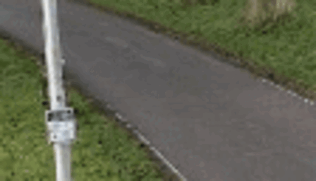

# Thesis_results

## Associating Scene effects to objects in dynamic scenes

#### Figure 1 
Dynamatte:

Omnimatte:

Comparison between Omnimatte and Dynamatte on a scene with dynamic traffic in the background. Omnimatte reconstructs this traffic in the foreground layer and Dynamatte reconstructs it in the background.

#### Figure 2
Dynamatte:

Omnimatte:

The reconstruction of a scene with two cyclists. On the left are dynamic background elements in the form of people doing a sports class, another cyclist and cars upon the bridge. Dynamatte partially reconstructs the dynamic scene elements in the background layer, whereas Omnimatte reconstructs all dynamic elements divided over the foreground object layers.
Omnimatte also reconstructs parts of the bike stands in the foreground layer due to errors in the homography estimation of the scene.

#### Figure 3
Dynamatte:

Omnimatte:

Busy intersection with large background elements, occlusions, overlapping shadows and correlated movement.

## Figure 4

  |  
:-------------------------:|:-------------------------:
Homography stabilization |  Homography-based sampling

The bad homography estimation of the video causes misalignment between the noise input and the scene.

#### Figure 5
Dynamatte:

Omnimatte:

The reconstruction of Omnimatte and Dynamatte on a noisy video.

## Figure 6
  |  
:-------------------------:|:-------------------------:
Homography stabilization | After stabilization the video is still noisy

## Figure 7
#### Figure 7a
Dynamatte:

Omnimatte:

#### Figure 7b
Dynamatte:

Omnimatte:

#### Figure 7c
Dynamatte:

Omnimatte:

## Figure 8
 | 
:-------------------------:|:-------------------------:
Homography stabilization | The input and video are misaligned.

## Figure 9
Dynamatte:

Omnimatte:

Two foreground objects that occlude each other. Reflections of both foreground objects out-of-frame objects in the background

Dynamatte:

Omnimatte:

A street hockey player. The puck is correctly associated to the foreground layer by both Omnimatte and Dynamatte. There are some dynamic elements in the background.

Dynamatte:

Omnimatte:

A dancer that is partially occluded by reeds in the foreground. There are some moving people in the background.

Dynamatte:

Omnimatte:

A person on rollerblades jumping. This is a simple scene with no dynamic background elements and not a lot of noise or depth. Both Omnimatte and Dynamatte perform well.

Dynamatte:

Omnimatte

A flamingo in the water. Omnimatte removes the ripples and reflection in the water better that Dynamatte.

## Video Completion

#### Busy intersection with large background elements, occlusions, overlapping shadows and correlated movement

Ground Truth	Dynamatte	Omnimatte	FGVC	Onion Peel

#### Bridge with dynamic background elements

Ground Truth	Dynamatte	Omnimatte	FGVC	Onion Peel

#### Bike path with depth and dynamic background elements

Ground Truth	Dynamatte	Omnimatte	FGVC	Onion Peel

#### cyclist whose shadow overlaps with reeds

Ground Truth	Dynamatte	Omnimatte	FGVC	Onion Peel

### DAVIS video's
#### 'Hockey': some small dynamic elements in the background

Ground Truth	Dynamatte	Omnimatte	FGVC	Onion Peel

#### 'Dance-jump': Dynamic elements in the background and reed occluding the foreground object

Ground Truth	Dynamatte	Omnimatte	FGVC	Onion Peel

#### 'Rollerblade': Fully static scene

Ground Truth	Dynamatte	Omnimatte	FGVC	Onion Peel

#### 'drift-chicane': smoke caused by foreground object and a haze of smoke in the foreground

Ground Truth	Dynamatte	Omnimatte	FGVC	Onion Peel

#### 'Flamingo': Ripples in the water caused by foreground object

Ground Truth	Dynamatte	Omnimatte	FGVC	Onion Peel

#### 'Cows': The pole in the foreground causes the shadow of the cow to be reconstructed in background

Ground Truth	Dynamatte	Omnimatte	FGVC	Onion Peel

#### 'Scooter-black': large camera movement with traffic in the background

Ground Truth	Dynamatte	Omnimatte	FGVC	Onion Peel

#### 'Car-roundabout': large camera movement with traffic in the background

# Ablation Study
## Global Context Volume
### Figure X
With Global Context Volume

Without Global Context Volume

## Background Dynamics Regularization
### Figure X
With background dynamics regularization:

Without background dynamics regularization:

With only the difference term of the background dynamics regularization:

With only the correlation term of the background dynamics regularization:

## Depth Reconstruction
### Figure X
With depth:

Without depth:

### Figure X
With depth:

Without depth:

